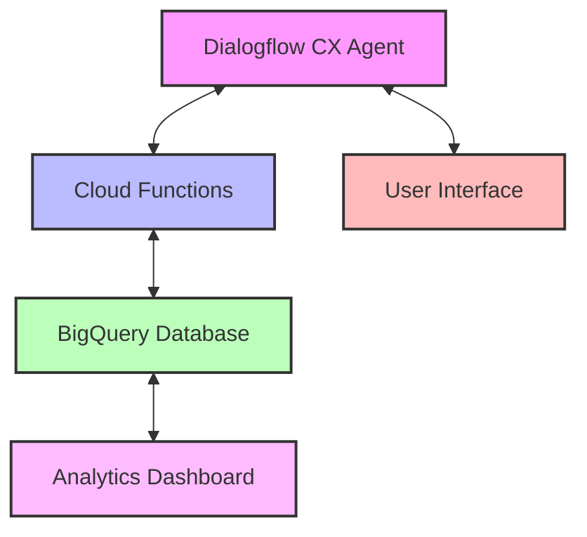
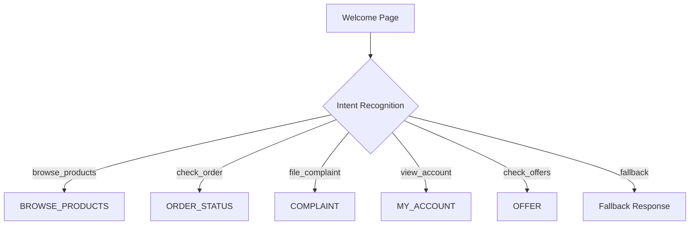
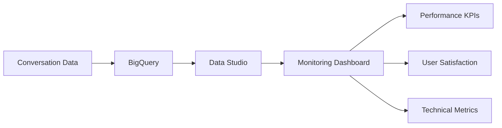
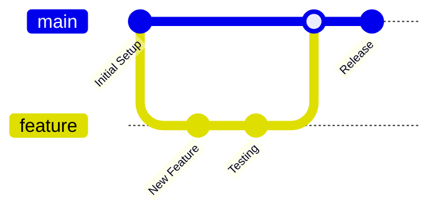

# 🛒💬 Shia E-Commerce Chatbot

<div align="center">
  
  
  
  
  
  [](https://github.com/yourusername/shia-ecommerce-chatbot)
  
</div>

<div align="center">
  <h3>🤖 Transforming E-commerce with Intelligent Conversation 🛍️</h3>
  <p><i>Powered by Google Cloud & Dialogflow CX</i></p>
</div>

---

## 📋 Project Overview

**Shia** is an advanced e-commerce chatbot built with Dialogflow CX, powered by Google Cloud Functions, and utilizing BigQuery for data storage and analytics. This conversational agent provides customers with a seamless shopping experience through natural language interactions.

> 💡 **Core Purpose**: To enhance customer experience by providing a conversational interface for e-commerce operations including product browsing, order tracking, account management, and customer support.

<details>
<summary>✨ Key Features</summary>

- 🔍 **Intelligent Product Search** - Natural language product discovery
- 📦 **Order Tracking** - Real-time updates on customer orders
- 🛠️ **Customer Support** - Automated issue resolution and complaint handling
- 👤 **Account Management** - User profile viewing and editing
- 🏷️ **Personalized Offers** - Custom promotions based on user preferences
- 📊 **Analytics Dashboard** - Comprehensive conversation insights
</details>

---

## 🏗️ Architecture

### High-Level Components



### 🔄 Flow Structure

The chatbot is organized around a hub-and-spoke model with the following main flows:

| Flow Name | Icon | Description | Primary Functions |
|-----------|------|-------------|-------------------|
| **Start Page** | 🚪 | Entry point and routing hub | Welcome, intent detection |
| **MAIN_MENU** | 🧭 | Primary navigation | Options presentation, routing |
| **ORDER_STATUS** | 📦 | Order tracking | Order lookup, status updates |
| **BROWSE_PRODUCTS** | 🔍 | Product discovery | Catalog search, filtering, recommendations |
| **COMPLAINT** | ⚠️ | Issue resolution | Complaint logging, escalation |
| **MY_ACCOUNT** | 👤 | User profile management | Profile viewing/editing, preferences |
| **OFFER** | 🏷️ | Promotions and deals | Personalized offers, discount codes |

---

## 🔧 Technical Components

### 1. 🧠 Dialogflow CX

**Shia** leverages Dialogflow CX's advanced conversation management capabilities:

<div class="tech-features">
  <div class="feature">
    <h4>🔄 State-based conversation management</h4>
    <p>Complex, multi-turn conversations</p>
  </div>
  <div class="feature">
    <h4>🏷️ Advanced entity handling</h4>
    <p>Product catalogs, user profiles, order details</p>
  </div>
  <div class="feature">
    <h4>📊 Flow-based design</h4>
    <p>Independent conversation modules with clear transitions</p>
  </div>
  <div class="feature">
    <h4>💬 Rich response types</h4>
    <p>Text, cards, carousels, quick replies</p>
  </div>
</div>

#### Agent Structure

```
shia-ecommerce-agent/
├── 📁 flows/
│   ├── 🚪 start.flow
│   ├── 🧭 main_menu.flow
│   ├── 📦 order_status.flow
│   ├── 🔍 browse_products.flow
│   ├── ⚠️ complaint.flow
│   ├── 👤 my_account.flow
│   └── 🏷️ offer.flow
├── 📁 intents/
│   ├── navigation_intents.json
│   ├── product_intents.json
│   ├── order_intents.json
│   └── ...
├── 📁 entities/
│   ├── product_type.json
│   ├── order_status.json
│   └── ...
└── 📁 webhooks/
    ├── product_lookup.json
    ├── order_fetch.json
    └── ...
```

### 2. ⚡ Cloud Functions

**Cloud Functions** serve as the backend processing layer, handling:

- 🔌 **Webhook fulfillment**: Dynamic responses based on database queries
- 🔗 **API integration**: Connections to inventory, order management, and payment systems
- 🔄 **Data processing**: Formatting and transforming data for both BigQuery and Dialogflow
- 🔒 **Authentication**: Secure user verification and session management

#### Key Functions

<details>
<summary>📋 View Example Code</summary>

```javascript
// Example of a product search function
exports.productSearch = (req, res) => {
  const parameters = req.body.queryResult.parameters;
  const productType = parameters.product_type;
  const priceRange = parameters.price_range;
  
  // Query products from database
  return queryProducts(productType, priceRange)
    .then(products => {
      // Format response for Dialogflow
      res.json({
        fulfillmentMessages: formatProductResults(products)
      });
    })
    .catch(err => {
      console.error('Error querying products:', err);
      res.status(500).send('Internal Server Error');
    });
};
```
</details>

### 3. 💾 BigQuery Database

**BigQuery** provides a scalable data storage solution with powerful analytics capabilities:

- 📐 **Schema Design**: Optimized for e-commerce data and conversation history
- ⚡ **Real-time Analytics**: Monitoring conversation performance and user behavior
- 🔄 **Data Integration**: Connected to product catalog, order system, and user profiles
- 📝 **Conversation Logging**: Complete history for improvement and personalization

#### Core Tables

| Table Name | Icon | Purpose | Key Fields |
|------------|------|---------|------------|
| `products` | 🛍️ | Product catalog | `product_id`, `name`, `price`, `category`, `inventory` |
| `orders` | 📦 | Order tracking | `order_id`, `user_id`, `status`, `items`, `total` |
| `users` | 👤 | Customer profiles | `user_id`, `name`, `preferences`, `history` |
| `conversations` | 💬 | Chat history | `session_id`, `timestamp`, `input`, `response`, `intent` |
| `complaints` | ⚠️ | Issue tracking | `complaint_id`, `user_id`, `type`, `status`, `resolution` |

---

## 🚀 Setup & Installation

### Prerequisites

<table>
  <tr>
    <td><b>🌐 Google Cloud Platform account</b></td>
    <td>with billing enabled</td>
  </tr>
  <tr>
    <td><b>🤖 Dialogflow CX API access</b></td>
    <td>for agent creation and management</td>
  </tr>
  <tr>
    <td><b>📦 Node.js v14+</b></td>
    <td>and npm for Cloud Functions</td>
  </tr>
  <tr>
    <td><b>⌨️ gcloud CLI</b></td>
    <td>for deployment and configuration</td>
  </tr>
</table>

### Installation Steps

<details>
<summary>🔧 Step 1: GCP Project Setup</summary>

```bash
# Create a new GCP project
gcloud projects create shia-ecommerce-chatbot --name="Shia E-commerce Chatbot"

# Set the project as current
gcloud config set project shia-ecommerce-chatbot

# Enable required APIs
gcloud services enable dialogflow.googleapis.com
gcloud services enable cloudfunctions.googleapis.com
gcloud services enable bigquery.googleapis.com
```
</details>

<details>
<summary>💾 Step 2: BigQuery Setup</summary>

```bash
# Create dataset
bq mk --dataset ecommerce_data

# Create tables from schema files
bq mk --table ecommerce_data.products schema/products_schema.json
bq mk --table ecommerce_data.orders schema/orders_schema.json
bq mk --table ecommerce_data.users schema/users_schema.json
bq mk --table ecommerce_data.conversations schema/conversations_schema.json
```
</details>

<details>
<summary>⚡ Step 3: Cloud Functions Deployment</summary>

```bash
# Navigate to functions directory
cd cloud_functions

# Install dependencies
npm install

# Deploy product search function
gcloud functions deploy productSearch \
  --runtime nodejs14 \
  --trigger-http \
  --allow-unauthenticated
  
# Deploy other functions similarly
gcloud functions deploy orderStatus \
  --runtime nodejs14 \
  --trigger-http \
  --allow-unauthenticated
```
</details>

<details>
<summary>🤖 Step 4: Dialogflow CX Setup</summary>

1. Create a new agent in Dialogflow CX console
2. Import the provided agent zip file from `dialogflow/shia-agent.zip`
3. Configure webhook URLs to point to your deployed Cloud Functions
4. Test the agent in the Dialogflow simulator
</details>

---

## 📝 Implementation Details

### Conversation Flows

#### 🚪 Start Page

The entry point for all conversations, responsible for:
- 👋 Welcoming users
- 🧠 Collecting basic context
- 🚦 Routing to appropriate specialized flows

#### 🧭 Main Menu Flow



#### 📦 Order Status Flow

<table>
<tr>
  <td><b>Step</b></td>
  <td><b>Process</b></td>
  <td><b>Details</b></td>
</tr>
<tr>
  <td>Order Identification</td>
  <td>
    • By Order Number<br>
    • By Recent Orders
  </td>
  <td>
    "What's your order number?"<br>
    "Here are your recent orders..."
  </td>
</tr>
<tr>
  <td>Status Retrieval</td>
  <td>Webhook: orderStatusLookup</td>
  <td>Cloud Function processes the request</td>
</tr>
<tr>
  <td>Status Communication</td>
  <td>
    • Status update<br>
    • Delivery ETA<br>
    • Tracking information
  </td>
  <td>"Your order #12345 is currently being shipped."</td>
</tr>
</table>

### Database Schema Details

<details>
<summary>📋 Products Table Schema</summary>

```json
[
  {"name": "product_id", "type": "STRING", "mode": "REQUIRED"},
  {"name": "name", "type": "STRING", "mode": "REQUIRED"},
  {"name": "description", "type": "STRING", "mode": "NULLABLE"},
  {"name": "price", "type": "FLOAT", "mode": "REQUIRED"},
  {"name": "category", "type": "STRING", "mode": "REQUIRED"},
  {"name": "subcategory", "type": "STRING", "mode": "NULLABLE"},
  {"name": "inventory_count", "type": "INTEGER", "mode": "REQUIRED"},
  {"name": "image_url", "type": "STRING", "mode": "NULLABLE"},
  {"name": "last_updated", "type": "TIMESTAMP", "mode": "REQUIRED"}
]
```
</details>

---

## 🔌 Integration Guide

### Webhook Configuration

Connect your Dialogflow CX agent to Cloud Functions by configuring webhooks:

<div class="steps-container">
  <div class="step">
    <div class="step-number">1</div>
    <div class="step-content">
      <p>In Dialogflow CX console, navigate to <b>Manage</b> tab</p>
    </div>
  </div>
  <div class="step">
    <div class="step-number">2</div>
    <div class="step-content">
      <p>Select <b>Webhooks</b></p>
    </div>
  </div>
  <div class="step">
    <div class="step-number">3</div>
    <div class="step-content">
      <p>Create a new webhook for each function:</p>
      <code>
      URL: https://[REGION]-[PROJECT_ID].cloudfunctions.net/[FUNCTION_NAME]<br>
      Method: POST<br>
      Request Format: Dialogflow CX Webhook Request
      </code>
    </div>
  </div>
</div>

### Testing Locally

For local development and testing:

```bash
# Install the Dialogflow CX CLI
npm install -g @google-cloud/dialogflow-cx

# Run local webhook server
npm run dev-server

# Test with simulated requests
dialogflow-cx simulate --project-id=shia-ecommerce-chatbot
```

---

## 📊 Performance Monitoring

### Key Metrics

Monitor these essential metrics:

<table>
  <tr>
    <th>Metric</th>
    <th>Description</th>
    <th>Target</th>
  </tr>
  <tr>
    <td>🎯 Conversation Completion Rate</td>
    <td>% of conversations reaching successful resolution</td>
    <td>>85%</td>
  </tr>
  <tr>
    <td>🧠 Intent Recognition Accuracy</td>
    <td>% of correctly identified user intents</td>
    <td>>90%</td>
  </tr>
  <tr>
    <td>⚠️ Fallback Rate</td>
    <td>% of queries resulting in fallback responses</td>
    <td><15%</td>
  </tr>
  <tr>
    <td>📏 Average Conversation Length</td>
    <td>Number of turns to complete common tasks</td>
    <td><5 turns</td>
  </tr>
  <tr>
    <td>😊 User Satisfaction</td>
    <td>Post-conversation ratings</td>
    <td>>4.2/5</td>
  </tr>
</table>

### Monitoring Dashboard



#### Example Monitoring Query

<details>
<summary>📋 Daily Fallback Rate Query</summary>

```sql
-- Example BigQuery monitoring query for daily fallback rate
SELECT
  DATE(timestamp) as date,
  COUNT(CASE WHEN intent = 'Default Fallback Intent' THEN 1 END) / COUNT(*) * 100 as fallback_rate
FROM
  ecommerce_data.conversations
GROUP BY
  date
ORDER BY
  date DESC
LIMIT 14;
```
</details>

---

## 🌐 Deployment

### Production Deployment Checklist

<div class="checklist">
  <div class="checklist-item">
    <input type="checkbox" id="check1">
    <label for="check1">Ensure all entity types are thoroughly tested</label>
  </div>
  <div class="checklist-item">
    <input type="checkbox" id="check2">
    <label for="check2">Verify all webhook connections are operational</label>
  </div>
  <div class="checklist-item">
    <input type="checkbox" id="check3">
    <label for="check3">Test full conversation flows from start to completion</label>
  </div>
  <div class="checklist-item">
    <input type="checkbox" id="check4">
    <label for="check4">Configure proper IAM permissions</label>
  </div>
  <div class="checklist-item">
    <input type="checkbox" id="check5">
    <label for="check5">Set up monitoring alerts</label>
  </div>
  <div class="checklist-item">
    <input type="checkbox" id="check6">
    <label for="check6">Establish CI/CD pipeline for agent updates</label>
  </div>
</div>

### Integration Options

| Platform | Icon | Integration Method | Documentation |
|----------|------|-------------------|--------------|
| Website | 🌐 | Dialogflow Messenger | [Documentation](https://cloud.google.com/dialogflow/cx/docs/concept/integration/dialogflow-messenger) |
| Mobile App | 📱 | Dialogflow API | [Documentation](https://cloud.google.com/dialogflow/cx/docs/reference/rest/v3/projects.locations.agents) |
| Facebook Messenger | 💬 | Built-in Integration | [Documentation](https://cloud.google.com/dialogflow/cx/docs/concept/integration/facebook) |
| Google Assistant | 🔊 | Built-in Integration | [Documentation](https://cloud.google.com/dialogflow/cx/docs/concept/integration/google-assistant) |

---

## 🔍 Troubleshooting Guide

### Common Issues

| Issue | Icon | Possible Causes | Solutions |
|-------|------|----------------|-----------|
| Intent recognition failures | 🧠 | Insufficient training phrases | Add more varied examples to training phrases |
| Webhook timeouts | ⏱️ | Function execution taking too long | Optimize database queries, add caching |
| Entity extraction issues | 🏷️ | Entity definitions too narrow | Broaden entity definitions, add synonyms |
| Conversation loops | 🔄 | Missing exit conditions in flows | Add clear exit paths, improve error handling |

### Debugging Tips

<details>
<summary>📋 View Cloud Function Logs</summary>

```bash
# View Cloud Function logs
gcloud functions logs read productSearch --limit=50
```
</details>

<details>
<summary>🔌 Test Webhook Directly</summary>

```bash
# Test webhook directly
curl -X POST \
  -H "Content-Type: application/json" \
  -d @test-payloads/product-search.json \
  https://[REGION]-[PROJECT_ID].cloudfunctions.net/productSearch
```
</details>

---

## 🔮 Future Enhancements

<div class="roadmap">
  <div class="roadmap-item">
    <div class="roadmap-icon">🌍</div>
    <div class="roadmap-content">
      <h4>Multi-language Support</h4>
      <p>Expanding to additional languages</p>
    </div>
  </div>
  <div class="roadmap-item">
    <div class="roadmap-icon">🔊</div>
    <div class="roadmap-content">
      <h4>Voice Interface</h4>
      <p>Adding telephony integration</p>
    </div>
  </div>
  <div class="roadmap-item">
    <div class="roadmap-icon">🎯</div>
    <div class="roadmap-content">
      <h4>Personalization Engine</h4>
      <p>Improved product recommendations</p>
    </div>
  </div>
  <div class="roadmap-item">
    <div class="roadmap-icon">💳</div>
    <div class="roadmap-content">
      <h4>Payment Processing</h4>
      <p>Direct checkout capabilities</p>
    </div>
  </div>
  <div class="roadmap-item">
    <div class="roadmap-icon">😊</div>
    <div class="roadmap-content">
      <h4>Sentiment Analysis</h4>
      <p>Real-time customer satisfaction monitoring</p>
    </div>
  </div>
</div>

---

## 👥 Contributing

Contributions are welcome! Please follow these steps:



1. Fork the repository
2. Create a feature branch (`git checkout -b feature/amazing-feature`)
3. Commit your changes (`git commit -m 'Add some amazing feature'`)
4. Push to the branch (`git push origin feature/amazing-feature`)
5. Open a Pull Request

See [CONTRIBUTING.md](CONTRIBUTING.md) for detailed guidelines.

---

## 📄 License

This project is licensed under the MIT License - see the [LICENSE](LICENSE) file for details.

---

## 🙏 Acknowledgements

<div class="acknowledgements">
  <div class="ack-item">
    <div class="ack-icon">☁️</div>
    <div class="ack-content">Google Cloud team for Dialogflow CX and BigQuery</div>
  </div>
  <div class="ack-item">
    <div class="ack-icon">🌐</div>
    <div class="ack-content">The open-source community for various tools and libraries</div>
  </div>
  <div class="ack-item">
    <div class="ack-icon">👥</div>
    <div class="ack-content">All contributors and testers who helped shape this project</div>
  </div>
</div>

---

<div align="center">
  <p>Made with ❤️ by the Shia Team</p>
  <p>
    <a href="https://github.com/yourusername/shia-ecommerce-chatbot">GitHub</a> •
    <a href="https://yourusername.github.io/shia-docs">Documentation</a> •
    <a href="mailto:contact@example.com">Contact</a>
  </p>
</div>
