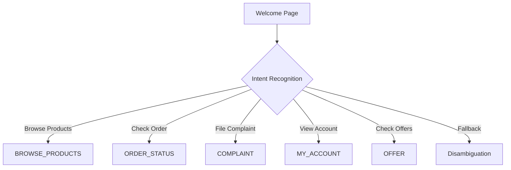

# 🛒 Shia E-Commerce Chatbot 💬

[](https://cloud.google.com/dialogflow/cx)
[](https://cloud.google.com/)
[](https://cloud.google.com/bigquery)

## 📋 Project Overview

**Shia** is an advanced e-commerce chatbot built with Dialogflow CX, powered by Google Cloud Functions, and utilizing BigQuery for data storage and analytics. This conversational agent provides customers with a seamless shopping experience through natural language interactions.

<div align="center">
  
</div>

> **💡 Core Purpose**: To enhance customer experience by providing a conversational interface for e-commerce operations including product browsing, order tracking, account management, and customer support.


### 🎥 Demo Video

<div align="center">
  
[](https://www.youtube.com/watch?v=UDTbExwh4vY)

</div>

## 🏗️ Architecture

### High-Level Components


### Flow Structure

The chatbot is organized around a hub-and-spoke model with the following main flows:

| Flow Name | Description | Primary Functions |
|-----------|-------------|-------------------|
| 🏠 **Start Page** | Entry point and routing hub | Welcome, intent detection |
| 📂 **MAIN_MENU** | Primary navigation | Options presentation, routing |
| 📦 **ORDER_STATUS** | Order tracking | Order lookup, status updates |
| 🔍 **BROWSE_PRODUCTS** | Product discovery | Catalog search, filtering, recommendations |
| ⚠️ **COMPLAINT** | Issue resolution | Complaint logging, escalation |
| 👤 **MY_ACCOUNT** | User profile management | Profile viewing/editing, preferences |
| 🎁 **OFFER** | Promotions and deals | Personalized offers, discount codes |

## 🔧 Technical Components

### 1. Dialogflow CX 🧠

**Shia** leverages Dialogflow CX's advanced conversation management capabilities:

- **State-based conversation management**: Complex, multi-turn conversations
- **Advanced entity handling**: Product catalogs, user profiles, order details
- **Flow-based design**: Independent conversation modules with clear transitions
- **Rich response types**: Text, cards, carousels, quick replies

### 2. Cloud Functions ⚡

**Cloud Functions** serve as the backend processing layer, handling:

<div class="feature-grid">
  <div class="feature">
    <h4>🔄 Webhook fulfillment</h4>
    <p>Dynamic responses based on database queries</p>
  </div>
  <div class="feature">
    <h4>🔌 API integration</h4>
    <p>Connections to inventory, order management, and payment systems</p>
  </div>
  <div class="feature">
    <h4>📊 Data processing</h4>
    <p>Formatting and transforming data for both BigQuery and Dialogflow</p>
  </div>
  <div class="feature">
    <h4>🔐 Authentication</h4>
    <p>Secure user verification and session management</p>
  </div>
</div>

### 3. BigQuery Database 💾

**BigQuery** provides a scalable data storage solution with powerful analytics capabilities:

- **Schema Design**: Optimized for e-commerce data and conversation history
- **Real-time Analytics**: Monitoring conversation performance and user behavior
- **Data Integration**: Connected to product catalog, order system, and user profiles
- **Conversation Logging**: Complete history for improvement and personalization

#### Core Tables

| Table Name | Purpose | Key Fields |
|------------|---------|------------|
| `products` | Product catalog | `product_id`, `name`, `price`, `category`, `inventory` |
| `orders` | Order tracking | `order_id`, `user_id`, `status`, `items`, `total` |
| `users` | Customer profiles | `user_id`, `name`, `preferences`, `history` |
| `conversations` | Chat history | `session_id`, `timestamp`, `input`, `response`, `intent` |
| `complaints` | Issue tracking | `complaint_id`, `user_id`, `type`, `status`, `resolution` |

## 🚀 Setup & Installation

### Prerequisites

<table>
  <tr>
    <td><b>🧰 Tools & Accounts</b></td>
    <td><b>📋 Requirements</b></td>
  </tr>
  <tr>
    <td>Google Cloud Platform</td>
    <td>Account with billing enabled</td>
  </tr>
  <tr>
    <td>Dialogflow CX</td>
    <td>API access enabled</td>
  </tr>
  <tr>
    <td>Node.js</td>
    <td>v14+ and npm</td>
  </tr>
  <tr>
    <td>gcloud CLI</td>
    <td>Latest version installed</td>
  </tr>
</table>

### Step 1: GCP Project Setup

```bash
# Create a new GCP project
gcloud projects create shia-ecommerce-chatbot --name="Shia E-commerce Chatbot"

# Set the project as current
gcloud config set project shia-ecommerce-chatbot

# Enable required APIs
gcloud services enable dialogflow.googleapis.com
gcloud services enable cloudfunctions.googleapis.com
gcloud services enable bigquery.googleapis.com
gcloud services enable run.googleapis.com
```

### Step 2: BigQuery Setup

```bash
# Create dataset
bq mk --dataset ecommerce_data

# Create tables from schema files
bq mk --table ecommerce_data.products schema/products_schema.json
bq mk --table ecommerce_data.orders schema/orders_schema.json
bq mk --table ecommerce_data.users schema/users_schema.json
bq mk --table ecommerce_data.conversations schema/conversations_schema.json
```

### Step 3: Cloud Functions Deployment

#### Option A: Deploy as Cloud Functions

```bash
# Navigate to functions directory
cd cloud_run_func

# Install dependencies
npm install

# Deploy product search function
gcloud functions deploy productSearch \
  --runtime nodejs14 \
  --trigger-http \
  --allow-unauthenticated
  
# Deploy other functions similarly
gcloud functions deploy orderStatus \
  --runtime nodejs14 \
  --trigger-http \
  --allow-unauthenticated
```

#### Option B: Deploy to Cloud Run

```bash
# Navigate to the Cloud Run function directory
cd cloud_run_func

# Build the Docker image
gcloud builds submit --tag gcr.io/YOUR_PROJECT_ID/shia-ecommerce-chatbot

# Deploy to Cloud Run
gcloud run deploy shia-ecommerce-chatbot \
  --image gcr.io/YOUR_PROJECT_ID/shia-ecommerce-chatbot \
  --platform managed \
  --region us-central1 \
  --allow-unauthenticated

### Step 4: Dialogflow CX Setup

1. Create a new agent in Dialogflow CX console
2. Import the provided agent zip file from `shia.zip`
3. Configure webhook URLs to point to your deployed Cloud Functions or Cloud Run service
4. Test the agent in the Dialogflow simulator

## 📝 Implementation Details

### Conversation Flows

#### Start Page

<div class="flow-description">
The entry point for all conversations, responsible for:
<ul>
  <li>Welcoming users</li>
  <li>Collecting basic context</li>
  <li>Routing to appropriate specialized flows</li>
</ul>
</div>

#### Main Menu Flow



#### Additional flows follow similar patterns...

### Database Schema Details

**Products Table Schema**
```json
[
  {"name": "product_id", "type": "STRING", "mode": "REQUIRED"},
  {"name": "name", "type": "STRING", "mode": "REQUIRED"},
  {"name": "description", "type": "STRING", "mode": "NULLABLE"},
  {"name": "price", "type": "FLOAT", "mode": "REQUIRED"},
  {"name": "category", "type": "STRING", "mode": "REQUIRED"},
  {"name": "subcategory", "type": "STRING", "mode": "NULLABLE"},
  {"name": "inventory_count", "type": "INTEGER", "mode": "REQUIRED"},
  {"name": "image_url", "type": "STRING", "mode": "NULLABLE"},
  {"name": "last_updated", "type": "TIMESTAMP", "mode": "REQUIRED"}
]
```

## 🔌 Integration Guide

### Webhook Configuration

Connect your Dialogflow CX agent to Cloud Functions by configuring webhooks:

<div class="steps-container">
  <div class="step">
    <div class="step-number">1</div>
    <div class="step-content">
      In Dialogflow CX console, navigate to <b>Manage</b> tab
    </div>
  </div>
  <div class="step">
    <div class="step-number">2</div>
    <div class="step-content">
      Select <b>Webhooks</b>
    </div>
  </div>
  <div class="step">
    <div class="step-number">3</div>
    <div class="step-content">
      Create a new webhook for each function:
      <pre>
URL: https://[REGION]-[PROJECT_ID].cloudfunctions.net/[FUNCTION_NAME]
Method: POST
Request Format: Dialogflow CX Webhook Request</pre>
    </div>
  </div>
</div>


## 📊 Performance Monitoring

### Key Metrics

Monitor these essential metrics:

<table>
  <tr>
    <th>Metric</th>
    <th>Target</th>
    <th>Importance</th>
  </tr>
  <tr>
    <td>🎯 Conversation Completion Rate</td>
    <td>> 85%</td>
    <td>Critical</td>
  </tr>
  <tr>
    <td>🧠 Intent Recognition Accuracy</td>
    <td>> 90%</td>
    <td>High</td>
  </tr>
  <tr>
    <td>⚠️ Fallback Rate</td>
    <td>< 15%</td>
    <td>Medium</td>
  </tr>
  <tr>
    <td>🔄 Average Conversation Length</td>
    <td>< 8 turns</td>
    <td>Medium</td>
  </tr>
  <tr>
    <td>😊 User Satisfaction</td>
    <td>> 4.2/5</td>
    <td>High</td>
  </tr>
</table>

### Monitoring Setup

```sql
-- Example BigQuery monitoring query for daily fallback rate
SELECT
  DATE(timestamp) as date,
  COUNT(CASE WHEN intent = 'Default Fallback Intent' THEN 1 END) / COUNT(*) * 100 as fallback_rate
FROM
  ecommerce_data.conversations
GROUP BY
  date
ORDER BY
  date DESC
LIMIT 14;
```

## 🌐 Deployment

### Production Deployment Checklist

<div class="checklist">
  <div class="checklist-item">
    <input type="checkbox" id="entity-types"> 
    <label for="entity-types">Ensure all entity types are thoroughly tested</label>
  </div>
  <div class="checklist-item">
    <input type="checkbox" id="webhook-connections"> 
    <label for="webhook-connections">Verify all webhook connections are operational</label>
  </div>
  <div class="checklist-item">
    <input type="checkbox" id="conversation-flows"> 
    <label for="conversation-flows">Test full conversation flows from start to completion</label>
  </div>
  <div class="checklist-item">
    <input type="checkbox" id="iam-permissions"> 
    <label for="iam-permissions">Configure proper IAM permissions</label>
  </div>
  <div class="checklist-item">
    <input type="checkbox" id="monitoring-alerts"> 
    <label for="monitoring-alerts">Set up monitoring alerts</label>
  </div>
  <div class="checklist-item">
    <input type="checkbox" id="cicd-pipeline"> 
    <label for="cicd-pipeline">Establish CI/CD pipeline for agent updates</label>
  </div>
</div>

### Integration Options

| Platform | Integration Method | Documentation Link |
|----------|-------------------|---------------------|
| 🌐 Website | Dialogflow Messenger | [Link](https://cloud.google.com/dialogflow/cx/docs/concept/integration/dialogflow-messenger) |
| 📱 Mobile App | Dialogflow API | [Link](https://cloud.google.com/dialogflow/cx/docs/reference/rest/v3/projects.locations.agents) |
| 💬 Facebook Messenger | Built-in Integration | [Link](https://cloud.google.com/dialogflow/cx/docs/concept/integration/facebook) |
| 🗣️ Google Assistant | Built-in Integration | [Link](https://cloud.google.com/dialogflow/cx/docs/concept/integration/google-assistant) |

## 🚢 Cloud Run Deployment

To deploy the webhook service to Google Cloud Run:

### Step 1: Build the Docker Image

```bash
# Navigate to the cloud_run_func directory
cd cloud_run_func

# Build the container image
gcloud builds submit --tag gcr.io/YOUR_PROJECT_ID/shia-webhook-service
```

### Step 2: Deploy to Cloud Run

```bash
# Deploy the container to Cloud Run
gcloud run deploy shia-webhook-service \
  --image gcr.io/YOUR_PROJECT_ID/shia-webhook-service \
  --platform managed \
  --region us-central1 \
  --allow-unauthenticated \
  --set-env-vars="PROJECT_ID=YOUR_PROJECT_ID"
```

### Step 3: Update Webhook URLs in Dialogflow CX

Once deployed, update your webhook URLs in Dialogflow CX:

```
https://shia-webhook-service-abcdefghij-uc.a.run.app
```

## 🔍 Troubleshooting Guide

### Common Issues

| Issue | Possible Causes | Solutions |
|-------|----------------|-----------|
| 🧠 Intent recognition failures | Insufficient training phrases | Add more varied examples to training phrases |
| ⏱️ Webhook timeouts | Function execution taking too long | Optimize database queries, add caching |
| 🏷️ Entity extraction issues | Entity definitions too narrow | Broaden entity definitions, add synonyms |
| 🔄 Conversation loops | Missing exit conditions in flows | Add clear exit paths, improve error handling |

### Debugging Tips

```bash
# View Cloud Function logs
gcloud functions logs read productSearch --limit=50

# View Cloud Run logs
gcloud logging read "resource.type=cloud_run_revision AND resource.labels.service_name=shia-webhook-service" --limit=50

# Test webhook directly
curl -X POST \
  -H "Content-Type: application/json" \
  -d @test-payloads/product-search.json \
  https://shia-webhook-service-abcdefghij-uc.a.run.app
```

## 🔮 Future Enhancements

<div class="enhancement-grid">
  <div class="enhancement">
    <h4>🌐 Multi-language Support</h4>
    <p>Expanding to additional languages</p>
    <span class="status planned">Planned</span>
  </div>
  <div class="enhancement">
    <h4>🔊 Voice Interface</h4>
    <p>Adding telephony integration</p>
    <span class="status in-progress">In Progress</span>
  </div>
  <div class="enhancement">
    <h4>🎯 Personalization Engine</h4>
    <p>Improved product recommendations</p>
    <span class="status planned">Planned</span>
  </div>
  <div class="enhancement">
    <h4>💳 Payment Processing</h4>
    <p>Direct checkout capabilities</p>
    <span class="status planned">Planned</span>
  </div>
  <div class="enhancement">
    <h4>😊 Sentiment Analysis</h4>
    <p>Real-time customer satisfaction monitoring</p>
    <span class="status in-progress">In Progress</span>
  </div>
</div>

## 👥 Contributing

Contributions are welcome! Please follow these steps:

1. Fork the repository
2. Create a feature branch (`git checkout -b feature/amazing-feature`)
3. Commit your changes (`git commit -m 'Add some amazing feature'`)
4. Push to the branch (`git push origin feature/amazing-feature`)
5. Open a Pull Request

See [CONTRIBUTING.md](CONTRIBUTING.md) for detailed guidelines.

## 📄 License

This project is licensed under the MIT License - see the [LICENSE](LICENSE) file for details.

## 🙏 Acknowledgements

- Google Cloud team for Dialogflow CX and BigQuery
- The open-source community for various tools and libraries
- All contributors and testers who helped shape this project

<div align="center">
  
  <p><b>Shia E-Commerce Chatbot</b> - Transforming online shopping through conversation!</p>
</div>

