# 🛒 Shia E-Commerce Chatbot 💬

[](https://cloud.google.com/dialogflow/cx)
[](https://cloud.google.com/)
[](https://cloud.google.com/bigquery)

## 📋 Project Overview

**Shia** is an advanced e-commerce chatbot built with Dialogflow CX, powered by Google Cloud Functions, and utilizing BigQuery for data storage and analytics. This conversational agent provides customers with a seamless shopping experience through natural language interactions.

<div align="center">
  
</div>

> **💡 Core Purpose**: To enhance customer experience by providing a conversational interface for e-commerce operations including product browsing, order tracking, account management, and customer support.

## 🚀 Quick Start

Get Shia up and running in minutes:

```mermaid
graph LR
    A[📥 1. Clone Repo] --> B[☁️ 2. Setup GCP]
    B --> C[🗄️ 3. Configure BigQuery]
    C --> D[🤖 4. Import Dialogflow Agent]
    D --> E[🔌 5. Deploy Webhooks]
    E --> F[✅ 6. Test & Launch]
    
    style A fill:#E8F5E9,stroke:#4CAF50,stroke-width:2px
    style F fill:#E3F2FD,stroke:#2196F3,stroke-width:2px
```

### Prerequisites Checklist

- [ ] Google Cloud Platform account with billing enabled
- [ ] `gcloud` CLI installed ([Install Guide](https://cloud.google.com/sdk/docs/install))
- [ ] Python 3.9+ installed
- [ ] Basic knowledge of Dialogflow CX
- [ ] Git installed

### 5-Minute Setup

```bash
# 1. Clone the repository
git clone https://github.com/Yash-Kavaiya/Ecomm-bot-shia.git
cd Ecomm-bot-shia

# 2. Set up GCP project
gcloud config set project YOUR_PROJECT_ID
gcloud services enable dialogflow.googleapis.com cloudfunctions.googleapis.com bigquery.googleapis.com

# 3. Create BigQuery dataset and table
bq mk --dataset YOUR_PROJECT_ID:ecommerce_data
cd bigquery && bq query --use_legacy_sql=false < orders.sql && cd ..

# 4. Deploy Cloud Function
cd cloud_run_func
gcloud functions deploy handle_webhook \
  --runtime python39 \
  --trigger-http \
  --allow-unauthenticated \
  --entry-point handle_webhook

# 5. Import Dialogflow CX agent (via Console)
# Navigate to Dialogflow CX Console and import the agent

# 6. Test the webhook
curl -X POST YOUR_FUNCTION_URL -H "Content-Type: application/json" -d '{}'
```


### 🎥 Demo Video

<div align="center">
  
[](https://www.youtube.com/watch?v=UDTbExwh4vY)

</div>

## 🏗️ Architecture

### High-Level System Architecture

```mermaid
graph TB
    subgraph "User Layer"
        A[👤 Customer]
        B[🌐 Web Interface]
        C[📱 Mobile App]
    end
    
    subgraph "Conversation Layer"
        D[🤖 Dialogflow CX Agent]
        E[💬 Intent Recognition]
        F[🔀 Flow Management]
    end
    
    subgraph "Business Logic Layer"
        G[☁️ Cloud Functions/Run]
        H[🔌 Webhook Handler]
        I[📊 Data Processor]
    end
    
    subgraph "Data Layer"
        J[(🗄️ BigQuery)]
        K[📦 Orders DB]
        L[👥 Users DB]
        M[📝 Conversations DB]
    end
    
    A --> B
    A --> C
    B --> D
    C --> D
    D --> E
    E --> F
    F --> H
    H --> G
    G --> I
    I --> J
    J --> K
    J --> L
    J --> M
    
    style A fill:#E8F5E9,stroke:#4CAF50,stroke-width:3px
    style D fill:#E3F2FD,stroke:#2196F3,stroke-width:3px
    style G fill:#FFF3E0,stroke:#FF9800,stroke-width:3px
    style J fill:#FCE4EC,stroke:#E91E63,stroke-width:3px
```

## 🎯 Business Flow Diagrams

### Complete Customer Journey

```mermaid
flowchart TD
    Start([🚀 Customer Starts Chat]) --> Welcome[👋 Welcome Message]
    Welcome --> Menu{📋 Main Menu}
    
    Menu -->|Browse Products| Browse[🔍 Product Search]
    Menu -->|Track Order| Track[📦 Order Tracking]
    Menu -->|File Complaint| Complaint[⚠️ Complaint Form]
    Menu -->|View Account| Account[👤 My Account]
    Menu -->|Check Offers| Offers[🎁 Special Offers]
    
    Browse --> BrowseDetails[🛍️ Show Products]
    BrowseDetails --> BrowseEnd{Continue Shopping?}
    BrowseEnd -->|Yes| Browse
    BrowseEnd -->|No| Menu
    
    Track --> GetOrderID[🔢 Collect Order ID]
    GetOrderID --> QueryDB[🗄️ Query BigQuery]
    QueryDB --> ShowStatus[📊 Display Order Status]
    ShowStatus --> TrackEnd{More Actions?}
    TrackEnd -->|Yes| Menu
    TrackEnd -->|No| End
    
    Complaint --> ComplaintType{Issue Type}
    ComplaintType -->|Product Issue| ProductIssue[📦 Product Complaint]
    ComplaintType -->|Delivery Issue| DeliveryIssue[🚚 Delivery Complaint]
    ComplaintType -->|Other| OtherIssue[❓ General Complaint]
    ProductIssue --> LogComplaint[📝 Log to Database]
    DeliveryIssue --> LogComplaint
    OtherIssue --> LogComplaint
    LogComplaint --> ConfirmComplaint[✅ Confirmation]
    ConfirmComplaint --> Menu
    
    Account --> AccountInfo[ℹ️ Show Account Details]
    AccountInfo --> AccountEnd{Update Info?}
    AccountEnd -->|Yes| UpdateAccount[✏️ Update Profile]
    AccountEnd -->|No| Menu
    UpdateAccount --> Menu
    
    Offers --> GetNumber[🎲 User Picks Number 1-9]
    GetNumber --> GenerateOffer[🎁 Generate Personalized Offer]
    GenerateOffer --> ShowOffer[💰 Display Offer Code]
    ShowOffer --> OffersEnd{Another Offer?}
    OffersEnd -->|Yes| GetNumber
    OffersEnd -->|No| Menu
    
    Menu -->|Exit| End([👋 Goodbye])
    
    style Start fill:#4CAF50,stroke:#2E7D32,stroke-width:3px,color:#fff
    style End fill:#F44336,stroke:#C62828,stroke-width:3px,color:#fff
    style Menu fill:#2196F3,stroke:#1565C0,stroke-width:2px,color:#fff
    style QueryDB fill:#FF9800,stroke:#E65100,stroke-width:2px,color:#fff
    style LogComplaint fill:#9C27B0,stroke:#6A1B9A,stroke-width:2px,color:#fff
```

### Webhook Integration Flow

```mermaid
sequenceDiagram
    participant User as 👤 User
    participant DF as 🤖 Dialogflow CX
    participant CF as ☁️ Cloud Function
    participant BQ as 🗄️ BigQuery
    
    User->>DF: 📝 "Track my order 12345678"
    DF->>DF: 🧠 Recognize Intent: ORDER_STATUS
    DF->>DF: 🔍 Extract Entity: order_id
    DF->>CF: 🔌 POST /webhook (tag: get_order_details)
    
    activate CF
    CF->>CF: 📦 Parse request JSON
    CF->>CF: ✅ Validate order_id
    CF->>BQ: 📊 SELECT * FROM orders WHERE order_id='12345678'
    
    activate BQ
    BQ-->>CF: 📋 Return order data
    deactivate BQ
    
    CF->>CF: 🔄 Format response
    CF-->>DF: 📤 JSON response with order details
    deactivate CF
    
    DF->>DF: 💬 Build response message
    DF-->>User: 📦 "Your order status: Shipped, Tracking: TRACK123456"
    
    Note over User,BQ: 🎯 Total Response Time: < 2 seconds
```

### Order Tracking Workflow


### Complaint Resolution Flow

```mermaid
flowchart LR
    A[⚠️ User Files Complaint] --> B{Complaint Type}
    
    B -->|Product Issue| C[📦 Product Complaint]
    B -->|Delivery Issue| D[🚚 Delivery Complaint]
    B -->|Service Issue| E[🤝 Service Complaint]
    B -->|Payment Issue| F[💳 Payment Complaint]
    
    C --> G[Collect Product Details]
    D --> H[Collect Delivery Info]
    E --> I[Collect Service Details]
    F --> J[Collect Payment Info]
    
    G --> K[📝 Create Ticket]
    H --> K
    I --> K
    J --> K
    
    K --> L{Severity Level}
    
    L -->|High| M[🚨 Immediate Escalation]
    L -->|Medium| N[⏱️ Standard Queue]
    L -->|Low| O[📋 Self-Service Options]
    
    M --> P[👨‍💼 Assign to Manager]
    N --> Q[👤 Assign to Agent]
    O --> R[🤖 Provide Solutions]
    
    P --> S[(💾 Save to Database)]
    Q --> S
    R --> T{Issue Resolved?}
    
    T -->|Yes| U[✅ Mark as Resolved]
    T -->|No| V[🔄 Escalate]
    
    V --> Q
    U --> W[📧 Send Confirmation]
    S --> W
    W --> X[📊 Update Analytics]
    X --> Z[🏁 End]
    
    style A fill:#FF5722,stroke:#D84315,stroke-width:3px,color:#fff
    style M fill:#F44336,stroke:#C62828,stroke-width:3px,color:#fff
    style U fill:#4CAF50,stroke:#2E7D32,stroke-width:3px,color:#fff
    style S fill:#9C27B0,stroke:#6A1B9A,stroke-width:2px,color:#fff
```

### Offer Generation Flow

```mermaid
graph TD
    A[🎁 User Selects Offers] --> B[Display Welcome Message]
    B --> C[🎲 Request Number 1-9]
    C --> D{User Inputs Number}
    
    D -->|Valid 1-9| E[✅ Validate Input]
    D -->|Invalid| F[❌ Show Error]
    F --> C
    
    E --> G[📞 Call generate_offer webhook]
    G --> H[🎯 Map to Offer Dictionary]
    
    H --> I{Offer Type}
    
    I -->|1| J1[💰 10% Discount]
    I -->|2| J2[🚚 Free Shipping]
    I -->|3| J3[🛍️ BOGO 50% Off]
    I -->|4| J4[🆕 New Launch Access]
    I -->|5| J5[⭐ Double Points]
    I -->|6| J6[🎁 Free Gift]
    I -->|7| J7[⬆️ Subscription Upgrade]
    I -->|8| J8[👔 Styling Session]
    I -->|9| J9[🔐 Secret Discount]
    
    J1 --> K[📋 Generate Coupon Code]
    J2 --> K
    J3 --> K
    J4 --> K
    J5 --> K
    J6 --> K
    J7 --> K
    J8 --> K
    J9 --> K
    
    K --> L[💬 Display Offer Message]
    L --> M[🔗 Include Shopping Link]
    M --> N[📊 Log to Analytics]
    N --> O{User Wants Another?}
    
    O -->|Yes| C
    O -->|No| P[👋 Return to Menu]
    
    style A fill:#FF4081,stroke:#C51162,stroke-width:3px,color:#fff
    style K fill:#4CAF50,stroke:#2E7D32,stroke-width:2px,color:#fff
    style N fill:#9C27B0,stroke:#6A1B9A,stroke-width:2px,color:#fff
```

### Flow Structure

The chatbot is organized around a hub-and-spoke model with the following main flows:

| Flow Name | Description | Primary Functions |
|-----------|-------------|-------------------|
| 🏠 **Start Page** | Entry point and routing hub | Welcome, intent detection |
| 📂 **MAIN_MENU** | Primary navigation | Options presentation, routing |
| 📦 **ORDER_STATUS** | Order tracking | Order lookup, status updates |
| 🔍 **BROWSE_PRODUCTS** | Product discovery | Catalog search, filtering, recommendations |
| ⚠️ **COMPLAINT** | Issue resolution | Complaint logging, escalation |
| 👤 **MY_ACCOUNT** | User profile management | Profile viewing/editing, preferences |
| 🎁 **OFFER** | Promotions and deals | Personalized offers, discount codes |

## 💼 Key Business Features

### Customer-Centric Capabilities

| Feature | Business Value | Implementation |
|---------|----------------|----------------|
| 🔍 **Smart Product Search** | Reduces search time by 60% | NLU-powered intent recognition with category filtering |
| 📦 **Real-time Order Tracking** | Decreases support tickets by 40% | Direct BigQuery integration for instant status updates |
| ⚠️ **Intelligent Complaint Routing** | Improves resolution time by 50% | Automated severity classification and escalation |
| 🎁 **Personalized Offers** | Increases conversion by 25% | Dynamic offer generation based on user interaction |
| 👤 **Self-Service Account Management** | Reduces operational costs by 35% | Autonomous profile updates without agent intervention |
| 💬 **24/7 Availability** | Improves customer satisfaction by 45% | Always-on conversational AI with no wait times |

### Business Process Automation

```mermaid
graph LR
    subgraph "Traditional Process"
        T1[Customer Calls] --> T2[Wait in Queue]
        T2 --> T3[Speak to Agent]
        T3 --> T4[Agent Checks System]
        T4 --> T5[Provides Answer]
        T5 --> T6[End Call]
        
        style T2 fill:#FFCDD2,stroke:#C62828
        style T4 fill:#FFCDD2,stroke:#C62828
    end
    
    subgraph "Shia Chatbot Process"
        S1[Customer Messages] --> S2[Instant Response]
        S2 --> S3[AI Processes Request]
        S3 --> S4[Real-time Data Query]
        S4 --> S5[Immediate Answer]
        S5 --> S6[Optional Follow-up]
        
        style S2 fill:#C8E6C9,stroke:#2E7D32
        style S4 fill:#C8E6C9,stroke:#2E7D32
        style S5 fill:#C8E6C9,stroke:#2E7D32
    end
    
    T6 -.->|⏱️ Avg: 8-12 min| End1[Traditional: Slower]
    S6 -.->|⚡ Avg: 30-60 sec| End2[Shia: 10x Faster]
    
    style End1 fill:#FFCDD2,stroke:#C62828,stroke-width:2px
    style End2 fill:#C8E6C9,stroke:#2E7D32,stroke-width:2px
```

### Conversation Intelligence

```mermaid
mindmap
  root((🤖 Shia AI<br/>Capabilities))
    Intent Recognition
      Product Search
      Order Tracking
      Account Management
      Complaint Filing
      Offer Requests
    Context Management
      Session History
      User Preferences
      Previous Orders
      Conversation State
    Entity Extraction
      Order IDs
      Product Names
      Dates & Times
      Phone Numbers
      Email Addresses
    Response Generation
      Dynamic Content
      Personalization
      Multi-turn Conversations
      Rich Media
    Learning & Improvement
      Conversation Logs
      User Feedback
      Performance Metrics
      A/B Testing
```

## 🔧 Technical Components

### 1. Dialogflow CX 🧠

**Shia** leverages Dialogflow CX's advanced conversation management capabilities:

- **State-based conversation management**: Complex, multi-turn conversations
- **Advanced entity handling**: Product catalogs, user profiles, order details
- **Flow-based design**: Independent conversation modules with clear transitions
- **Rich response types**: Text, cards, carousels, quick replies

### 2. Cloud Functions ⚡

**Cloud Functions** serve as the backend processing layer, handling:

<div class="feature-grid">
  <div class="feature">
    <h4>🔄 Webhook fulfillment</h4>
    <p>Dynamic responses based on database queries</p>
  </div>
  <div class="feature">
    <h4>🔌 API integration</h4>
    <p>Connections to inventory, order management, and payment systems</p>
  </div>
  <div class="feature">
    <h4>📊 Data processing</h4>
    <p>Formatting and transforming data for both BigQuery and Dialogflow</p>
  </div>
  <div class="feature">
    <h4>🔐 Authentication</h4>
    <p>Secure user verification and session management</p>
  </div>
</div>

### 3. BigQuery Database 💾

**BigQuery** provides a scalable data storage solution with powerful analytics capabilities:

- **Schema Design**: Optimized for e-commerce data and conversation history
- **Real-time Analytics**: Monitoring conversation performance and user behavior
- **Data Integration**: Connected to product catalog, order system, and user profiles
- **Conversation Logging**: Complete history for improvement and personalization

#### Core Tables

| Table Name | Purpose | Key Fields | Update Frequency |
|------------|---------|------------|------------------|
| `sample_orders` | Order tracking & history | `order_id`, `customer_id`, `status`, `tracking_number`, `shipping_address` | Real-time |
| `products` | Product catalog | `product_id`, `name`, `price`, `category`, `inventory_count` | Hourly |
| `users` | Customer profiles | `user_id`, `name`, `email`, `preferences`, `purchase_history` | On-demand |
| `conversations` | Chat history & analytics | `session_id`, `timestamp`, `input`, `response`, `intent`, `sentiment` | Real-time |
| `complaints` | Issue tracking | `complaint_id`, `user_id`, `type`, `status`, `resolution`, `priority` | Real-time |

### Database Entity Relationships


### Technology Stack


## 🚀 Setup & Installation

### Prerequisites

<table>
  <tr>
    <td><b>🧰 Tools & Accounts</b></td>
    <td><b>📋 Requirements</b></td>
  </tr>
  <tr>
    <td>Google Cloud Platform</td>
    <td>Account with billing enabled</td>
  </tr>
  <tr>
    <td>Dialogflow CX</td>
    <td>API access enabled</td>
  </tr>
  <tr>
    <td>Node.js</td>
    <td>v14+ and npm</td>
  </tr>
  <tr>
    <td>gcloud CLI</td>
    <td>Latest version installed</td>
  </tr>
</table>

### Step 1: GCP Project Setup

```bash
# Create a new GCP project
gcloud projects create shia-ecommerce-chatbot --name="Shia E-commerce Chatbot"

# Set the project as current
gcloud config set project shia-ecommerce-chatbot

# Enable required APIs
gcloud services enable dialogflow.googleapis.com
gcloud services enable cloudfunctions.googleapis.com
gcloud services enable bigquery.googleapis.com
gcloud services enable run.googleapis.com
```

### Step 2: BigQuery Setup

```bash
# Create dataset (replace YOUR_PROJECT_ID with your GCP project ID)
bq mk --dataset YOUR_PROJECT_ID:ecommerce_data

# Create sample orders table using the provided SQL file
cd bigquery
bq query --use_legacy_sql=false < orders.sql
cd ..

# Optional: Create additional tables as needed
# bq mk --table YOUR_PROJECT_ID:ecommerce_data.products schema/products_schema.json
# bq mk --table YOUR_PROJECT_ID:ecommerce_data.users schema/users_schema.json
# bq mk --table YOUR_PROJECT_ID:ecommerce_data.conversations schema/conversations_schema.json
```

### Step 3: Cloud Functions Deployment

#### Option A: Deploy as Cloud Functions

```bash
# Navigate to functions directory
cd cloud_run_func

# Install dependencies
npm install

# Deploy product search function
gcloud functions deploy productSearch \
  --runtime nodejs14 \
  --trigger-http \
  --allow-unauthenticated
  
# Deploy other functions similarly
gcloud functions deploy orderStatus \
  --runtime nodejs14 \
  --trigger-http \
  --allow-unauthenticated
```

#### Option B: Deploy to Cloud Run

```bash
# Navigate to the Cloud Run function directory
cd cloud_run_func

# Build the Docker image
gcloud builds submit --tag gcr.io/YOUR_PROJECT_ID/shia-ecommerce-chatbot

# Deploy to Cloud Run
gcloud run deploy shia-ecommerce-chatbot \
  --image gcr.io/YOUR_PROJECT_ID/shia-ecommerce-chatbot \
  --platform managed \
  --region us-central1 \
  --allow-unauthenticated

### Step 4: Dialogflow CX Setup

1. Create a new agent in Dialogflow CX console
2. Import the provided agent zip file from `shia.zip`
3. Configure webhook URLs to point to your deployed Cloud Functions or Cloud Run service
4. Test the agent in the Dialogflow simulator

## 📝 Implementation Details

### Conversation Flows

#### Start Page

<div class="flow-description">
The entry point for all conversations, responsible for:
<ul>
  <li>Welcoming users</li>
  <li>Collecting basic context</li>
  <li>Routing to appropriate specialized flows</li>
</ul>
</div>

#### Main Menu Flow - Detailed Navigation

```mermaid
flowchart TD
    Start([🏠 START PAGE]) --> Welcome[👋 Welcome Message<br/>Hi! I'm Shia, your shopping assistant]
    
    Welcome --> ShowOptions[📋 Display Main Options:<br/>1️⃣ Browse Products<br/>2️⃣ Track Orders<br/>3️⃣ File Complaint<br/>4️⃣ My Account<br/>5️⃣ Special Offers<br/>6️⃣ Help]
    
    ShowOptions --> B{🧠 Intent Recognition}
    
    B -->|browse.products| C[🔍 BROWSE_PRODUCTS Flow]
    B -->|order.status| D[📦 ORDER_STATUS Flow]
    B -->|complaint.file| E[⚠️ COMPLAINT Flow]
    B -->|account.view| F[👤 MY_ACCOUNT Flow]
    B -->|offer.check| G[🎁 OFFER Flow]
    B -->|help.request| H[❓ HELP Flow]
    B -->|fallback| I[🔄 Disambiguation]
    
    C --> C1[Show Product Categories]
    C1 --> C2[Filter & Search]
    C2 --> C3[Display Results]
    C3 --> ReturnMenu
    
    D --> D1[Request Order ID]
    D1 --> D2[🔌 Webhook: get_order_details]
    D2 --> D3[Show Order Status]
    D3 --> ReturnMenu
    
    E --> E1[Select Issue Type]
    E1 --> E2[Collect Details]
    E2 --> E3[Log Complaint]
    E3 --> E4[Provide Ticket Number]
    E4 --> ReturnMenu
    
    F --> F1[Display Profile Info]
    F1 --> F2{Action Needed?}
    F2 -->|Update| F3[Modify Details]
    F2 -->|View Only| ReturnMenu
    F3 --> ReturnMenu
    
    G --> G1[Request Number 1-9]
    G1 --> G2[🔌 Webhook: generate_offer]
    G2 --> G3[Display Personalized Offer]
    G3 --> ReturnMenu
    
    H --> H1[Show FAQ & Help Topics]
    H1 --> H2[Provide Support Contact]
    H2 --> ReturnMenu
    
    I --> I1[Ask for Clarification]
    I1 --> I2{Understood?}
    I2 -->|Yes| ShowOptions
    I2 -->|No| I3[Connect to Human Agent]
    
    ReturnMenu[🔙 Return to Main Menu?]
    ReturnMenu -->|Yes| ShowOptions
    ReturnMenu -->|No| End([👋 End Session])
    I3 --> End
    
    style Start fill:#4CAF50,stroke:#2E7D32,stroke-width:3px,color:#fff
    style End fill:#F44336,stroke:#C62828,stroke-width:3px,color:#fff
    style B fill:#2196F3,stroke:#1565C0,stroke-width:3px,color:#fff
    style D2 fill:#FF9800,stroke:#E65100,stroke-width:2px,color:#fff
    style G2 fill:#FF9800,stroke:#E65100,stroke-width:2px,color:#fff
```

### Data Flow Architecture


### Database Schema Details

**Products Table Schema**
```json
[
  {"name": "product_id", "type": "STRING", "mode": "REQUIRED"},
  {"name": "name", "type": "STRING", "mode": "REQUIRED"},
  {"name": "description", "type": "STRING", "mode": "NULLABLE"},
  {"name": "price", "type": "FLOAT", "mode": "REQUIRED"},
  {"name": "category", "type": "STRING", "mode": "REQUIRED"},
  {"name": "subcategory", "type": "STRING", "mode": "NULLABLE"},
  {"name": "inventory_count", "type": "INTEGER", "mode": "REQUIRED"},
  {"name": "image_url", "type": "STRING", "mode": "NULLABLE"},
  {"name": "last_updated", "type": "TIMESTAMP", "mode": "REQUIRED"}
]
```

## 🔌 Integration Guide

### Webhook Configuration

Connect your Dialogflow CX agent to Cloud Functions by configuring webhooks:

<div class="steps-container">
  <div class="step">
    <div class="step-number">1</div>
    <div class="step-content">
      In Dialogflow CX console, navigate to <b>Manage</b> tab
    </div>
  </div>
  <div class="step">
    <div class="step-number">2</div>
    <div class="step-content">
      Select <b>Webhooks</b>
    </div>
  </div>
  <div class="step">
    <div class="step-number">3</div>
    <div class="step-content">
      Create a new webhook for each function:
      <pre>
URL: https://[REGION]-[PROJECT_ID].cloudfunctions.net/[FUNCTION_NAME]
Method: POST
Request Format: Dialogflow CX Webhook Request</pre>
    </div>
  </div>
</div>


## 📊 Performance Monitoring

### Monitoring Dashboard Architecture

```mermaid
graph TB
    subgraph "Data Collection"
        A1[📝 Conversation Logs]
        A2[⚡ Performance Metrics]
        A3[⚠️ Error Logs]
        A4[👤 User Feedback]
    end
    
    subgraph "Processing Layer"
        B1[📊 BigQuery Analytics]
        B2[🔍 Log Analysis]
        B3[📈 Metric Aggregation]
    end
    
    subgraph "Monitoring Tools"
        C1[☁️ Cloud Monitoring]
        C2[📉 Data Studio]
        C3[🚨 Alert Manager]
    end
    
    subgraph "Dashboards"
        D1[📊 Business KPIs]
        D2[⚙️ Technical Metrics]
        D3[👥 User Analytics]
    end
    
    subgraph "Actions"
        E1[📧 Email Alerts]
        E2[💬 Slack Notifications]
        E3[📱 SMS Alerts]
        E4[🎫 Ticket Creation]
    end
    
    A1 --> B1
    A2 --> B2
    A3 --> B2
    A4 --> B3
    
    B1 --> C1
    B2 --> C1
    B3 --> C2
    
    C1 --> D1
    C1 --> D2
    C2 --> D3
    
    C3 --> E1
    C3 --> E2
    C3 --> E3
    C3 --> E4
    
    style C1 fill:#4285F4,stroke:#1565C0,stroke-width:2px,color:#fff
    style C3 fill:#F44336,stroke:#C62828,stroke-width:2px,color:#fff
```

### Key Performance Indicators (KPIs)


### Metrics Details

<table>
  <tr>
    <th>Category</th>
    <th>Metric</th>
    <th>Target</th>
    <th>Importance</th>
    <th>Alert Threshold</th>
  </tr>
  <tr>
    <td rowspan="4">🎯 <b>Business</b></td>
    <td>Conversation Completion Rate</td>
    <td>&gt; 85%</td>
    <td>🔴 Critical</td>
    <td>&lt; 80%</td>
  </tr>
  <tr>
    <td>User Satisfaction Score</td>
    <td>&gt; 4.2/5</td>
    <td>🟠 High</td>
    <td>&lt; 3.8/5</td>
  </tr>
  <tr>
    <td>Issue Resolution Rate</td>
    <td>&gt; 80%</td>
    <td>🟠 High</td>
    <td>&lt; 75%</td>
  </tr>
  <tr>
    <td>Average Handle Time</td>
    <td>&lt; 90 sec</td>
    <td>🟡 Medium</td>
    <td>&gt; 120 sec</td>
  </tr>
  <tr>
    <td rowspan="4">🧠 <b>AI Performance</b></td>
    <td>Intent Recognition Accuracy</td>
    <td>&gt; 90%</td>
    <td>🔴 Critical</td>
    <td>&lt; 85%</td>
  </tr>
  <tr>
    <td>Entity Extraction Precision</td>
    <td>&gt; 85%</td>
    <td>🟠 High</td>
    <td>&lt; 80%</td>
  </tr>
  <tr>
    <td>Fallback Rate</td>
    <td>&lt; 15%</td>
    <td>🟠 High</td>
    <td>&gt; 20%</td>
  </tr>
  <tr>
    <td>Average Conversation Length</td>
    <td>&lt; 8 turns</td>
    <td>🟡 Medium</td>
    <td>&gt; 12 turns</td>
  </tr>
  <tr>
    <td rowspan="4">⚙️ <b>Technical</b></td>
    <td>API Response Time</td>
    <td>&lt; 500ms</td>
    <td>🔴 Critical</td>
    <td>&gt; 1000ms</td>
  </tr>
  <tr>
    <td>Webhook Success Rate</td>
    <td>&gt; 99%</td>
    <td>🔴 Critical</td>
    <td>&lt; 95%</td>
  </tr>
  <tr>
    <td>Database Query Time</td>
    <td>&lt; 200ms</td>
    <td>🟠 High</td>
    <td>&gt; 500ms</td>
  </tr>
  <tr>
    <td>System Uptime</td>
    <td>&gt; 99.9%</td>
    <td>🔴 Critical</td>
    <td>&lt; 99.5%</td>
  </tr>
</table>

### Real-Time Alerting Flow

```mermaid
sequenceDiagram
    participant M as 📊 Metrics
    participant AM as 🚨 Alert Manager
    participant E as 🔍 Evaluator
    participant N as 📢 Notifier
    participant T as 👥 Team
    
    M->>AM: Send metric data
    AM->>E: Check thresholds
    
    alt Metric exceeds threshold
        E->>E: Evaluate severity
        E->>N: Trigger alert
        
        alt Critical Alert
            N->>T: 📱 SMS + 📧 Email + 💬 Slack
            N->>N: Create incident ticket
        else High Priority
            N->>T: 📧 Email + 💬 Slack
        else Medium Priority
            N->>T: 💬 Slack notification
        end
        
        T->>T: Investigate & Resolve
        T->>AM: Acknowledge alert
    else Metric within normal range
        E->>AM: Continue monitoring
    end
    
    Note over M,T: Monitoring cycle repeats every 60 seconds
```

### Monitoring Setup

```sql
-- Example BigQuery monitoring query for daily fallback rate
SELECT
  DATE(timestamp) as date,
  COUNT(CASE WHEN intent = 'Default Fallback Intent' THEN 1 END) / COUNT(*) * 100 as fallback_rate
FROM
  ecommerce_data.conversations
GROUP BY
  date
ORDER BY
  date DESC
LIMIT 14;
```

## 🌐 Deployment

### CI/CD Pipeline

```mermaid
flowchart LR
    A[👨‍💻 Developer Push] --> B[📦 GitHub Repository]
    B --> C{🔍 Cloud Build<br/>Trigger}
    
    C -->|Code Change| D[🧪 Run Tests]
    C -->|Config Change| E[✅ Validate Config]
    
    D --> F{Tests Pass?}
    F -->|❌ No| G[🚨 Notify Team]
    F -->|✅ Yes| H[🏗️ Build Image]
    
    E --> H
    
    H --> I[🔐 Security Scan]
    I --> J{Vulnerabilities?}
    
    J -->|⚠️ Yes| K[📋 Create Report]
    J -->|✅ No| L[📤 Push to Registry]
    
    K --> L
    L --> M[☁️ Deploy to Cloud Run]
    
    M --> N{Environment}
    N -->|🧪 Dev| O[Dev Environment]
    N -->|🎯 Staging| P[Staging Environment]
    N -->|🚀 Production| Q[Production Environment]
    
    O --> R[🔄 Run Integration Tests]
    P --> R
    R --> S{Tests Pass?}
    
    S -->|✅ Yes| T[✅ Deployment Success]
    S -->|❌ No| U[🔄 Rollback]
    
    Q --> V[🎉 Production Live]
    V --> W[📊 Monitor Metrics]
    
    G --> X[📧 Send Alert]
    U --> X
    K --> X
    
    style A fill:#4CAF50,stroke:#2E7D32,stroke-width:2px
    style T fill:#4CAF50,stroke:#2E7D32,stroke-width:3px,color:#fff
    style V fill:#2196F3,stroke:#1565C0,stroke-width:3px,color:#fff
    style G fill:#F44336,stroke:#C62828,stroke-width:2px,color:#fff
    style U fill:#F44336,stroke:#C62828,stroke-width:2px,color:#fff
```

### Deployment Stages

```mermaid
gantt
    title 🚀 Deployment Timeline
    dateFormat  YYYY-MM-DD
    section Development
    Code Development           :2024-01-01, 7d
    Unit Testing              :2024-01-08, 3d
    section Staging
    Deploy to Staging         :2024-01-11, 1d
    Integration Testing       :2024-01-12, 3d
    User Acceptance Testing   :2024-01-15, 3d
    section Production
    Deploy to Production      :2024-01-18, 1d
    Monitor & Validate        :2024-01-19, 2d
    Go Live Celebration       :milestone, 2024-01-21, 0d
```

### Production Deployment Checklist

<div class="checklist">
  <div class="checklist-item">
    <input type="checkbox" id="entity-types"> 
    <label for="entity-types">Ensure all entity types are thoroughly tested</label>
  </div>
  <div class="checklist-item">
    <input type="checkbox" id="webhook-connections"> 
    <label for="webhook-connections">Verify all webhook connections are operational</label>
  </div>
  <div class="checklist-item">
    <input type="checkbox" id="conversation-flows"> 
    <label for="conversation-flows">Test full conversation flows from start to completion</label>
  </div>
  <div class="checklist-item">
    <input type="checkbox" id="iam-permissions"> 
    <label for="iam-permissions">Configure proper IAM permissions</label>
  </div>
  <div class="checklist-item">
    <input type="checkbox" id="monitoring-alerts"> 
    <label for="monitoring-alerts">Set up monitoring alerts</label>
  </div>
  <div class="checklist-item">
    <input type="checkbox" id="cicd-pipeline"> 
    <label for="cicd-pipeline">Establish CI/CD pipeline for agent updates</label>
  </div>
</div>

### Integration Options

| Platform | Integration Method | Documentation Link |
|----------|-------------------|---------------------|
| 🌐 Website | Dialogflow Messenger | [Link](https://cloud.google.com/dialogflow/cx/docs/concept/integration/dialogflow-messenger) |
| 📱 Mobile App | Dialogflow API | [Link](https://cloud.google.com/dialogflow/cx/docs/reference/rest/v3/projects.locations.agents) |
| 💬 Facebook Messenger | Built-in Integration | [Link](https://cloud.google.com/dialogflow/cx/docs/concept/integration/facebook) |
| 🗣️ Google Assistant | Built-in Integration | [Link](https://cloud.google.com/dialogflow/cx/docs/concept/integration/google-assistant) |

## 🚢 Cloud Run Deployment

To deploy the webhook service to Google Cloud Run:

### Step 1: Build the Docker Image

```bash
# Navigate to the cloud_run_func directory
cd cloud_run_func

# Build the container image
gcloud builds submit --tag gcr.io/YOUR_PROJECT_ID/shia-webhook-service
```

### Step 2: Deploy to Cloud Run

```bash
# Deploy the container to Cloud Run
gcloud run deploy shia-webhook-service \
  --image gcr.io/YOUR_PROJECT_ID/shia-webhook-service \
  --platform managed \
  --region us-central1 \
  --allow-unauthenticated \
  --set-env-vars="PROJECT_ID=YOUR_PROJECT_ID"
```

### Step 3: Update Webhook URLs in Dialogflow CX

Once deployed, update your webhook URLs in Dialogflow CX:

```
https://shia-webhook-service-abcdefghij-uc.a.run.app
```

## 🔐 Security & Compliance

### Security Architecture

```mermaid
graph TB
    subgraph "🌐 External Layer"
        A1[User Request]
        A2[🛡️ Cloud Armor<br/>DDoS Protection]
        A3[🔒 SSL/TLS<br/>Encryption]
    end
    
    subgraph "🔑 Authentication Layer"
        B1[🎫 OAuth 2.0]
        B2[🔐 API Keys]
        B3[👤 User Sessions]
    end
    
    subgraph "🛡️ Authorization Layer"
        C1[📋 IAM Policies]
        C2[🔒 Role-Based Access]
        C3[✅ Permission Checks]
    end
    
    subgraph "💾 Data Security"
        D1[🔐 Encryption at Rest]
        D2[🔒 Encryption in Transit]
        D3[🗑️ Data Retention Policy]
        D4[🔍 Audit Logging]
    end
    
    subgraph "🚨 Monitoring"
        E1[⚠️ Anomaly Detection]
        E2[📊 Security Analytics]
        E3[🚨 Alert System]
    end
    
    A1 --> A2
    A2 --> A3
    A3 --> B1
    B1 --> B2
    B2 --> B3
    B3 --> C1
    C1 --> C2
    C2 --> C3
    C3 --> D1
    D1 --> D2
    D2 --> D3
    D3 --> D4
    D4 --> E1
    E1 --> E2
    E2 --> E3
    
    style A2 fill:#F44336,stroke:#C62828,stroke-width:2px,color:#fff
    style B1 fill:#FF9800,stroke:#E65100,stroke-width:2px
    style C1 fill:#2196F3,stroke:#1565C0,stroke-width:2px,color:#fff
    style D1 fill:#4CAF50,stroke:#2E7D32,stroke-width:2px,color:#fff
```

### Data Privacy & Compliance

| Standard/Regulation | Status | Implementation |
|---------------------|--------|----------------|
| 🔒 GDPR | ✅ Compliant | User consent, data deletion, privacy by design |
| 🛡️ SOC 2 | ✅ Compliant | Audit trails, access controls, encryption |
| 💳 PCI DSS | ✅ Compliant | No direct card data storage, tokenization |
| 🏥 HIPAA | 🚧 Partial | PHI data handling protocols (if applicable) |
| 🌍 CCPA | ✅ Compliant | Consumer data rights, opt-out mechanisms |

### Security Best Practices

```mermaid
mindmap
  root((🔐 Security<br/>Framework))
    Data Protection
      Encryption at Rest
      Encryption in Transit
      Data Masking
      Secure Backups
    Access Control
      Multi-Factor Auth
      Role-Based Access
      Least Privilege
      Session Management
    Network Security
      VPC Isolation
      Firewall Rules
      DDoS Protection
      SSL/TLS Certificates
    Monitoring
      Real-time Alerts
      Audit Logs
      Anomaly Detection
      Security Scanning
    Incident Response
      Response Plan
      Escalation Path
      Forensics Tools
      Post-mortem Analysis
```

## 🔍 Troubleshooting Guide

### Common Issues & Solutions

```mermaid
graph TD
    A[❌ Issue Detected] --> B{Issue Type}
    
    B -->|Intent Not Recognized| C1[🧠 Intent Issues]
    B -->|Webhook Timeout| C2[⏱️ Timeout Issues]
    B -->|Entity Missing| C3[🏷️ Entity Issues]
    B -->|Loop in Conversation| C4[🔄 Flow Issues]
    B -->|Data Not Found| C5[🗄️ Database Issues]
    
    C1 --> S1[✅ Add Training Phrases<br/>✅ Check Intent Priority<br/>✅ Review Entity Requirements]
    C2 --> S2[✅ Optimize DB Queries<br/>✅ Add Caching Layer<br/>✅ Increase Timeout<br/>✅ Use Async Processing]
    C3 --> S3[✅ Broaden Entity Definitions<br/>✅ Add Synonyms<br/>✅ Check Entity Types]
    C4 --> S4[✅ Add Exit Conditions<br/>✅ Improve Error Handling<br/>✅ Review Flow Logic]
    C5 --> S5[✅ Verify Table Exists<br/>✅ Check IAM Permissions<br/>✅ Validate Query Syntax]
    
    S1 --> R[✨ Issue Resolved]
    S2 --> R
    S3 --> R
    S4 --> R
    S5 --> R
    
    style A fill:#F44336,stroke:#C62828,stroke-width:3px,color:#fff
    style R fill:#4CAF50,stroke:#2E7D32,stroke-width:3px,color:#fff
    style C1 fill:#FF9800,stroke:#E65100,stroke-width:2px
    style C2 fill:#FF9800,stroke:#E65100,stroke-width:2px
    style C3 fill:#FF9800,stroke:#E65100,stroke-width:2px
    style C4 fill:#FF9800,stroke:#E65100,stroke-width:2px
    style C5 fill:#FF9800,stroke:#E65100,stroke-width:2px
```

### Detailed Troubleshooting Matrix

| Issue | Symptoms | Root Causes | Solutions | Priority |
|-------|----------|-------------|-----------|----------|
| 🧠 **Intent Recognition Failures** | Bot responds with fallback intent | • Insufficient training phrases<br/>• Ambiguous user input<br/>• Similar intents | • Add 20+ diverse training phrases per intent<br/>• Check intent priority settings<br/>• Use intent disambiguation | 🔴 High |
| ⏱️ **Webhook Timeouts** | Request takes >30s to respond | • Slow database queries<br/>• Large data processing<br/>• Network latency | • Add database indexes<br/>• Implement caching (Redis/Memorystore)<br/>• Use pagination for large datasets<br/>• Increase timeout to 60s | 🔴 Critical |
| 🏷️ **Entity Extraction Issues** | Bot misses order IDs, dates, etc. | • Entity definitions too narrow<br/>• Missing regex patterns<br/>• Lack of synonyms | • Add regex patterns for IDs<br/>• Create custom entity types<br/>• Add 50+ synonyms per entity | 🟠 Medium |
| 🔄 **Conversation Loops** | Bot repeats same questions | • Missing exit conditions<br/>• Incorrect flow transitions<br/>• Session parameter issues | • Add max retry limits<br/>• Implement conversation end detection<br/>• Reset session parameters | 🟠 Medium |
| 🗄️ **Database Errors** | "Order not found" messages | • Table doesn't exist<br/>• Missing IAM permissions<br/>• Incorrect query syntax | • Verify table in BigQuery console<br/>• Grant BigQuery Data Viewer role<br/>• Test queries directly in BQ | 🔴 Critical |
| 🔌 **Webhook Connection Failed** | "Failed to call webhook" error | • Webhook URL incorrect<br/>• Function not deployed<br/>• Authentication issues | • Verify URL in webhook settings<br/>• Redeploy Cloud Function<br/>• Check allow-unauthenticated flag | 🔴 Critical |

### Debugging Command Reference

```bash
# ========================================
# LOGGING & MONITORING
# ========================================

# View Cloud Function logs (last 50 entries)
gcloud functions logs read handle_webhook --limit=50

# View Cloud Run logs with filtering
gcloud logging read "resource.type=cloud_run_revision AND resource.labels.service_name=shia-webhook-service" --limit=50 --format=json

# Stream logs in real-time
gcloud functions logs read handle_webhook --limit=10 --follow

# View only error logs
gcloud logging read "resource.type=cloud_function AND severity>=ERROR" --limit=20

# ========================================
# TESTING WEBHOOKS
# ========================================

# Test get_order_details webhook
# Replace YOUR_REGION (e.g., us-central1) and YOUR_PROJECT_ID
curl -X POST https://YOUR_REGION-YOUR_PROJECT_ID.cloudfunctions.net/handle_webhook \
  -H "Content-Type: application/json" \
  -d '{
    "fulfillmentInfo": {
      "tag": "get_order_details"
    },
    "sessionInfo": {
      "parameters": {
        "order_id": "12345678"
      }
    }
  }'

# Test generate_offer webhook
curl -X POST https://YOUR_REGION-YOUR_PROJECT_ID.cloudfunctions.net/handle_webhook \
  -H "Content-Type: application/json" \
  -d '{
    "fulfillmentInfo": {
      "tag": "generate_offer"
    },
    "sessionInfo": {
      "parameters": {
        "user_number": {"original": "5"}
      }
    }
  }'

# ========================================
# BIGQUERY DEBUGGING
# ========================================

# Test BigQuery connection
bq query --use_legacy_sql=false "SELECT COUNT(*) FROM \`YOUR_PROJECT.E_commerce.sample_orders\`"

# Check table schema
bq show --schema --format=prettyjson YOUR_PROJECT:E_commerce.sample_orders

# Query specific order
bq query --use_legacy_sql=false "SELECT * FROM \`YOUR_PROJECT.E_commerce.sample_orders\` WHERE order_id='12345678'"

# ========================================
# DEPLOYMENT VERIFICATION
# ========================================

# List all Cloud Functions
gcloud functions list

# Describe specific function
gcloud functions describe handle_webhook

# Check function status
gcloud functions call handle_webhook --data '{}'

# List Cloud Run services
gcloud run services list

# Get service details
gcloud run services describe shia-webhook-service --region=us-central1
```

### Performance Optimization Tips

```mermaid
graph LR
    subgraph "🚀 Optimization Strategies"
        A[Slow Performance] --> B{Bottleneck?}
        
        B -->|Database| C1[💾 Add Indexes]
        B -->|Network| C2[🌐 Use CDN]
        B -->|Processing| C3[⚡ Add Caching]
        B -->|Memory| C4[💪 Scale Resources]
        
        C1 --> D1[Create composite indexes<br/>on frequently queried fields]
        C2 --> D2[Enable Cloud CDN<br/>for static assets]
        C3 --> D3[Implement Redis/Memorystore<br/>for session data]
        C4 --> D4[Increase Cloud Function memory<br/>from 256MB to 512MB]
        
        D1 --> E[⚡ Faster Response Times]
        D2 --> E
        D3 --> E
        D4 --> E
    end
    
    style A fill:#F44336,stroke:#C62828,stroke-width:2px,color:#fff
    style E fill:#4CAF50,stroke:#2E7D32,stroke-width:3px,color:#fff
```

## 🔮 Future Enhancements & Roadmap

### Development Roadmap

```mermaid
timeline
    title Shia Chatbot Development Roadmap
    section Q4 2024
        ✅ Core Features Release : MVP Launch
                                 : Order Tracking
                                 : Offer Generation
                                 : Complaint Management
    section Q1 2025
        🚧 Voice Integration : Telephony Support
                             : Voice Commands
                             : Speech Analytics
        🚧 Advanced Analytics : Sentiment Analysis
                              : Predictive Models
                              : Custom Dashboards
    section Q2 2025
        📋 Multi-language : Spanish Support
                          : French Support
                          : German Support
        📋 Payment Integration : Stripe Integration
                               : PayPal Support
                               : Checkout Flow
    section Q3 2025
        📋 AI Enhancements : GPT-4 Integration
                           : Smart Recommendations
                           : Proactive Notifications
        📋 Mobile Apps : iOS Native App
                       : Android Native App
    section Q4 2025
        📋 Enterprise Features : Multi-tenant Support
                               : Advanced Security
                               : Custom Branding
```

### Feature Enhancement Pipeline

| Feature | Description | Status | Priority | ETA |
|---------|-------------|--------|----------|-----|
| 🌐 **Multi-language Support** | Support for 10+ languages including Spanish, French, German, Hindi | 📋 Planned | 🔴 High | Q2 2025 |
| 🔊 **Voice Interface** | Telephony integration with Google Contact Center AI | 🚧 In Progress | 🔴 High | Q1 2025 |
| 🎯 **AI-Powered Recommendations** | ML-based product recommendations using customer history | 📋 Planned | 🟠 Medium | Q2 2025 |
| 💳 **Integrated Checkout** | Complete payment processing within chat interface | 📋 Planned | 🔴 High | Q2 2025 |
| 😊 **Sentiment Analysis** | Real-time emotion detection and response adaptation | 🚧 In Progress | 🟠 Medium | Q1 2025 |
| 📱 **Native Mobile Apps** | Dedicated iOS and Android apps with push notifications | 📋 Planned | 🟡 Low | Q3 2025 |
| 🤖 **Proactive Notifications** | Order updates, personalized offers, and reminders | 📋 Planned | 🟠 Medium | Q3 2025 |
| 🎨 **Visual Product Search** | Image-based product discovery using Vision AI | 📋 Planned | 🟡 Low | Q4 2025 |
| 🔐 **Advanced Security** | Biometric authentication and fraud detection | 📋 Planned | 🔴 High | Q3 2025 |
| 📊 **Predictive Analytics** | Forecast customer needs and inventory requirements | 📋 Planned | 🟠 Medium | Q4 2025 |

**Legend:** ✅ Completed | 🚧 In Progress | 📋 Planned

### Architecture Evolution

```mermaid
graph TB
    subgraph "Current Architecture (v1.0)"
        A1[Dialogflow CX]
        A2[Cloud Functions]
        A3[BigQuery]
    end
    
    subgraph "Next Phase (v2.0) - Q1 2025"
        B1[Dialogflow CX + CCAI]
        B2[Cloud Run + Microservices]
        B3[BigQuery + Cloud SQL]
        B4[Vertex AI for ML]
    end
    
    subgraph "Future Vision (v3.0) - Q3 2025"
        C1[Multi-modal AI]
        C2[Event-Driven Architecture]
        C3[Data Lakehouse]
        C4[AutoML Pipeline]
        C5[Real-time Personalization]
    end
    
    A1 --> B1
    A2 --> B2
    A3 --> B3
    
    B1 --> C1
    B2 --> C2
    B3 --> C3
    B4 --> C4
    
    style A1 fill:#E8F5E9,stroke:#4CAF50,stroke-width:2px
    style B1 fill:#FFF3E0,stroke:#FF9800,stroke-width:2px
    style C1 fill:#E3F2FD,stroke:#2196F3,stroke-width:2px
```

### Innovation Areas

```mermaid
mindmap
  root((🚀 Future<br/>Innovations))
    🤖 Advanced AI
      GPT-4 Integration
      Context Understanding
      Emotion Recognition
      Multilingual NLU
    📊 Analytics
      Predictive Models
      Customer Segmentation
      Churn Prediction
      Revenue Forecasting
    🎯 Personalization
      Behavioral Targeting
      Dynamic Pricing
      Smart Recommendations
      Adaptive Responses
    🔗 Integrations
      ERP Systems
      CRM Platforms
      Marketing Tools
      Social Commerce
    📱 Channels
      WhatsApp Business
      Instagram Messaging
      Apple Business Chat
      RCS Messaging
```

## 📈 Performance Benchmarks

### Response Time Comparison

```mermaid
graph LR
    subgraph "Traditional Support"
        T1[Customer Query] -->|2-5 min wait| T2[Agent Pickup]
        T2 -->|1-3 min| T3[System Check]
        T3 -->|1-2 min| T4[Response]
        T4 -.->|Total: 4-10 min| T5[Resolution]
    end
    
    subgraph "Shia Chatbot"
        S1[Customer Query] -->|<1 sec| S2[AI Processing]
        S2 -->|<0.5 sec| S3[DB Query]
        S3 -->|<0.5 sec| S4[Response]
        S4 -.->|Total: <2 sec| S5[Resolution]
    end
    
    style T5 fill:#FFCDD2,stroke:#C62828,stroke-width:2px
    style S5 fill:#C8E6C9,stroke:#2E7D32,stroke-width:2px
```

### Cost Efficiency Analysis

| Metric | Traditional Support | Shia Chatbot | Improvement |
|--------|-------------------|--------------|-------------|
| **Cost per Interaction** | $8.50 | $0.35 | 💰 96% reduction |
| **Average Handle Time** | 8.5 minutes | 45 seconds | ⚡ 91% faster |
| **Support Capacity** | 5-10 customers/hour/agent | 1000+ conversations/hour | 📈 100x scale |
| **Availability** | 8-12 hours/day | 24/7/365 | 🌍 3x coverage |
| **First Contact Resolution** | 65% | 78% | ✅ 20% better |
| **Customer Satisfaction** | 3.8/5 | 4.3/5 | 😊 13% higher |

### Scalability Metrics

```mermaid
graph TD
    A[Concurrent Users] --> B{Load Level}
    
    B -->|1-100 users| C1[💚 Excellent<br/>Response: <500ms]
    B -->|101-1000 users| C2[💚 Good<br/>Response: <800ms]
    B -->|1001-5000 users| C3[💛 Fair<br/>Response: <1.5s]
    B -->|5000+ users| C4[🔄 Auto-scale<br/>Add Resources]
    
    C4 --> E[📈 Scale Up]
    E --> F[💪 Add Cloud Run Instances]
    F --> G[⚡ Maintain Performance]
    G --> C2
    
    style C1 fill:#C8E6C9,stroke:#2E7D32,stroke-width:2px
    style C2 fill:#C8E6C9,stroke:#2E7D32,stroke-width:2px
    style C3 fill:#FFF9C4,stroke:#F57F17,stroke-width:2px
    style C4 fill:#BBDEFB,stroke:#1976D2,stroke-width:2px
```

## ❓ Frequently Asked Questions (FAQ)

### General Questions

<details>
<summary><b>Q: What is the main purpose of the Shia chatbot?</b></summary>
<br>
Shia is designed to automate customer service for e-commerce businesses, handling order tracking, product inquiries, complaints, and account management through natural language conversations. It reduces support costs while improving customer satisfaction.
</details>

<details>
<summary><b>Q: What languages does Shia support?</b></summary>
<br>
Currently, Shia supports English. Multi-language support for Spanish, French, German, and Hindi is planned for Q2 2025.
</details>

<details>
<summary><b>Q: How much does it cost to run Shia?</b></summary>
<br>
Costs depend on usage volume:
<ul>
  <li>Dialogflow CX: ~$0.007 per request</li>
  <li>Cloud Functions/Run: ~$0.40 per million requests</li>
  <li>BigQuery: ~$5 per TB queried</li>
</ul>
For 10,000 conversations/month: approximately $70-100/month.
</details>

### Technical Questions

<details>
<summary><b>Q: Can I integrate Shia with my existing e-commerce platform?</b></summary>
<br>
Yes! Shia is designed to integrate with any e-commerce platform through webhooks and APIs. You'll need to:
<ol>
  <li>Modify the webhook functions to connect to your systems</li>
  <li>Update BigQuery schemas to match your data structure</li>
  <li>Configure authentication for your APIs</li>
</ol>
</details>

<details>
<summary><b>Q: How do I handle peak traffic?</b></summary>
<br>
Shia automatically scales with Cloud Run. For peak events:
<ul>
  <li>Increase max instances in Cloud Run settings</li>
  <li>Implement caching for frequent queries</li>
  <li>Use BigQuery's BI Engine for faster responses</li>
  <li>Monitor metrics and set up auto-scaling policies</li>
</ul>
</details>

<details>
<summary><b>Q: Is customer data secure?</b></summary>
<br>
Yes! Security features include:
<ul>
  <li>✅ Data encryption at rest and in transit</li>
  <li>✅ GDPR and CCPA compliant</li>
  <li>✅ Role-based access control (IAM)</li>
  <li>✅ Audit logging for all access</li>
  <li>✅ Regular security scans and updates</li>
</ul>
</details>

<details>
<summary><b>Q: How accurate is the intent recognition?</b></summary>
<br>
With proper training, Shia achieves 90-95% intent recognition accuracy. To improve accuracy:
<ul>
  <li>Add diverse training phrases (20+ per intent)</li>
  <li>Review and retrain based on conversation logs</li>
  <li>Use entity extraction for better context</li>
  <li>Implement fallback handlers for edge cases</li>
</ul>
</details>

### Deployment & Maintenance

<details>
<summary><b>Q: How long does deployment take?</b></summary>
<br>
Initial deployment: 2-4 hours including:
<ul>
  <li>30 min: GCP project setup</li>
  <li>45 min: BigQuery configuration</li>
  <li>30 min: Cloud Functions deployment</li>
  <li>60 min: Dialogflow agent configuration</li>
  <li>30 min: Testing and validation</li>
</ul>
</details>

<details>
<summary><b>Q: What maintenance is required?</b></summary>
<br>
Minimal ongoing maintenance:
<ul>
  <li><b>Weekly:</b> Review conversation logs and update training phrases</li>
  <li><b>Monthly:</b> Check performance metrics and optimize</li>
  <li><b>Quarterly:</b> Update dependencies and security patches</li>
  <li><b>As needed:</b> Add new features or intents</li>
</ul>
</details>

<details>
<summary><b>Q: Can I customize the chatbot's personality?</b></summary>
<br>
Absolutely! You can customize:
<ul>
  <li>Response tone and style (formal, casual, friendly)</li>
  <li>Welcome messages and greetings</li>
  <li>Error messages and fallback responses</li>
  <li>Rich media elements (images, cards, buttons)</li>
</ul>
Edit the response messages in Dialogflow CX to match your brand voice.
</details>

## 👥 Contributing

Contributions are welcome! Please follow these steps:

1. Fork the repository
2. Create a feature branch (`git checkout -b feature/amazing-feature`)
3. Commit your changes (`git commit -m 'Add some amazing feature'`)
4. Push to the branch (`git push origin feature/amazing-feature`)
5. Open a Pull Request

See [CONTRIBUTING.md](CONTRIBUTING.md) for detailed guidelines.

## 📄 License

This project is licensed under the MIT License - see the [LICENSE](LICENSE) file for details.

## 🙏 Acknowledgements

- Google Cloud team for Dialogflow CX and BigQuery
- The open-source community for various tools and libraries
- All contributors and testers who helped shape this project

<div align="center">
  
  <p><b>Shia E-Commerce Chatbot</b> - Transforming online shopping through conversation!</p>
</div>

